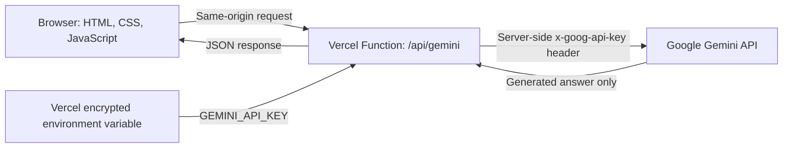

<div align="center">

# EduMind AI

### One calm, responsive learning workspace for students, teachers, and parents

[](https://developer.mozilla.org/docs/Web/HTML)
[](https://developer.mozilla.org/docs/Web/CSS)
[](https://developer.mozilla.org/docs/Web/JavaScript)
[](https://ai.google.dev/gemini-api/docs)
[](https://vercel.com)

**[Open the live demo](https://edumind-uii-sandbox.vercel.app)**

</div>

---

## What is EduMind?

EduMind is a bilingual education web app prototype designed around the people who share a student's learning journey. Each role gets a focused dashboard, while Gemini provides real AI responses through a secure Vercel backend.

The project deliberately uses a small stack: semantic HTML, responsive CSS, vanilla JavaScript, and two Node.js serverless functions. There is no React, database, UI framework, or client-side API key.

## Experience at a Glance

| Role | Core experiences |
| --- | --- |
| **Student** | 24/7 Socratic AI tutor, live camera worksheet capture, OCR-style grading, personalized review pathway, MathVision-style practice studio |
| **Teacher** | Handwritten assignment feedback, differentiated exam matrix generator, competency reports, floating AI assistant |
| **Parent** | Weekly learning digest, emotional support plan, grade report, practical Gemini parent advisor |

Every dashboard supports English and Vietnamese, including British and Vietnamese flag controls. Layouts adapt from wide desktop screens to mobile phones, with touch-friendly navigation and controls.

## Product Highlights

### Student workspace

- The Socratic tutor guides thinking with questions instead of immediately giving away answers.
- The camera uses the real device camera through `getUserMedia`.
- Captured worksheet images can be sent to Gemini for multimodal OCR-style analysis and feedback.
- A demo review pathway shows how learning gaps can become manageable next-step exercises.
- The MathVision-style studio adds AI gap diagnostics, a math mind map, AI question generation, online exams, math arena, leaderboard, flashcards, math tools, a resource library, FAQ, and a locked teacher-room demo.

### Teacher workspace

- Smart grading turns a photographed handwritten assignment into step recognition and suggested qualitative feedback.
- The exam generator builds a Recognition, Understanding, Application, and Advanced Application matrix.
- Generated exams open in a focused modal with Download and Discard actions.
- Competency charts summarize class mastery, while a floating Gemini chatbot supports daily teacher tasks.

### Parent workspace

- A weekly digest makes progress and learning friction easy to scan.
- The emotional support plan gives calm, practical actions for home.
- The grade report combines scores, movement, and subject-level context.
- The parent advisor explains learning data without blame or unnecessary jargon.

## How the AI Key Stays Hidden



The browser never receives `GEMINI_API_KEY`. It only sends prompts or captured image data to `/api/gemini`. The serverless function reads the secret from `process.env`, calls Google, and returns the generated text.

Security details:

- `.env*` and `.vercel/` are excluded from Git.
- The Gemini key is sent to Google in the `x-goog-api-key` request header, not in browser code or a request URL.
- The production API is same-origin; wildcard CORS is not enabled.
- Git history and tracked files are checked for key-shaped values before release.

> The prototype login is intentionally a demo, not authentication. The key is hidden, but public visitors can still use the public AI endpoint and consume its quota. Add real authentication and rate limiting before using this as a production service.

## Architecture

```text
EduMind
|-- index.html                 # App shell and reusable SVG icon sprite
|-- css/
|   `-- styles.css             # Responsive visual system for all roles
|-- scripts/
|   |-- script.js              # Routing, UI state, camera, and API calls
|   `-- build-vercel.js        # Copies static assets into dist/
|-- api/
|   |-- config.js              # Reports whether the server key is configured
|   |-- gemini.js              # Vercel serverless API endpoint
|   `-- gemini-core.js         # Shared Gemini request logic
|-- local-server.js            # Dependency-free local development server
`-- vercel.json                # Vercel build and output configuration
```

## Demo Routes

| Route | Screen |
| --- | --- |
| `#/login/student` | Student login |
| `#/login/teacher` | Teacher login |
| `#/login/parent` | Parent login |
| `#/student` | Student dashboard |
| `#/teacher` | Teacher dashboard |
| `#/parent` | Parent dashboard |

The login is demo-only. Enter any non-empty email and password to continue.

## Run Locally

Requirements: Node.js 18 or newer and a Gemini API key from [Google AI Studio](https://aistudio.google.com/app/apikey).

1. Create `.env` in the project root if you want local Gemini calls:

   ```env
   GEMINI_API_KEY=your_real_key_here
   ```

2. Start the dependency-free local server:

   ```powershell
   npm start
   ```

3. Open [http://127.0.0.1:4174](http://127.0.0.1:4174).

No `npm install` step is required because the project has no external runtime dependencies.

## Deploy to Vercel

1. Import this GitHub repository into Vercel.
2. Keep the project root as `.`. The committed `vercel.json` selects the **Other** framework preset, runs `npm run build`, and publishes `dist`.
3. Open **Project Settings > Environment Variables**.
4. Add `GEMINI_API_KEY`, mark it **Sensitive**, and enable it for Production and Preview.
5. Deploy or redeploy after saving the variable. Environment changes do not affect an already-created deployment.

Expected production endpoints:

```text
GET  /api/config
POST /api/gemini
```

Never put the key in `scripts/script.js`, `index.html`, `vercel.json`, or any variable whose value is exposed to the browser.

## Judge Walkthrough

1. Choose Student, Teacher, or Parent on the login screen and enter any demo credentials.
2. Switch between English and Vietnamese using the flag control.
3. On Student, review the MathVision-style feature studio, ask the Socratic tutor a question, and allow camera access to test worksheet capture.
4. On Teacher, generate an exam, inspect the blurred-background modal, and open the floating assistant.
5. On Parent, review the weekly digest, emotional support plan, grade report, and AI advisor.
6. Resize the browser or use a phone to inspect the responsive navigation and layouts.

## Verification

Run the same lightweight syntax and build checks used before deployment:

```powershell
npm run check
```

Camera access requires HTTPS in production. Vercel provides HTTPS automatically; `localhost` and `127.0.0.1` are accepted for local development.

---

<div align="center">
  <strong>EduMind AI</strong><br />
  Designed for clearer learning conversations at school and at home.
</div>
